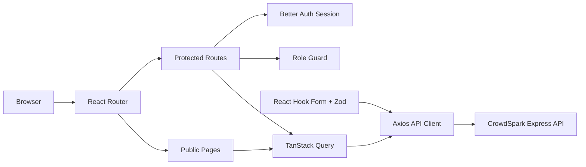

<div align="center">

# CrowdSpark

### A role-based crowdfunding platform for discovering ideas, funding campaigns with credits, and managing transparent financial workflows.

[](https://react.dev/)
[](https://www.typescriptlang.org/)
[](https://vite.dev/)
[](https://tailwindcss.com/)
[](https://www.better-auth.com/)
[](#license)

[Live Website](https://YOUR_CLIENT_DOMAIN.vercel.app) · [Server API](https://YOUR_SERVER_DOMAIN.onrender.com) · [Client Repository](https://github.com/YOUR_GITHUB_USERNAME/CrowdSpark-client) · [Server Repository](https://github.com/YOUR_GITHUB_USERNAME/CrowdSpark-server)

</div>

> [!IMPORTANT]
> Replace every `YOUR_*` placeholder and add the real screenshots before final submission.

---

## Table of Contents

- [Overview](#overview)
- [Project Links](#project-links)
- [Demo Credentials](#demo-credentials)
- [User Roles](#user-roles)
- [Core Features](#core-features)
- [Technology Stack](#technology-stack)
- [Frontend Architecture](#frontend-architecture)
- [Application Routes](#application-routes)
- [Screenshots](#screenshots)
- [Getting Started](#getting-started)
- [Environment Variables](#environment-variables)
- [Available Scripts](#available-scripts)
- [Testing](#testing)
- [Deployment](#deployment)
- [Related Repository](#related-repository)
- [Author](#author)

---

## Overview

**CrowdSpark** is a full-stack crowdfunding platform where Supporters discover approved campaigns, purchase platform credits, contribute to campaigns, track their contribution history, request refunds, report suspicious campaigns, and receive notifications.

Creators can launch and manage campaigns, review contributions, publish progress updates, track raised credits, and request withdrawals. Admins oversee the platform by managing users, moderating campaigns, resolving reports, processing withdrawals, and reviewing financial records.

This repository contains the **React + Vite + TypeScript frontend** of CrowdSpark. The application is responsive across mobile, tablet, laptop, and desktop devices and uses protected role-based dashboard routes.

---

## Project Links

| Resource | URL |
|---|---|
| Live Website | `https://YOUR_CLIENT_DOMAIN.vercel.app` |
| Live API | `https://YOUR_SERVER_DOMAIN.onrender.com` |
| Client Repository | `https://github.com/YOUR_GITHUB_USERNAME/CrowdSpark-client` |
| Server Repository | `https://github.com/YOUR_GITHUB_USERNAME/CrowdSpark-server` |

---

## Demo Credentials

| Role | Email | Password |
|---|---|---|
| Admin | `admin@crowdspark.demo` | `Admin12345` |
| Creator | `creator@crowdspark.demo` | `Creator12345` |
| Supporter | `supporter@crowdspark.demo` | `Supporter12345` |

> Demo credentials are intended only for project review. Replace or disable them before using the application with real users.

---

## User Roles

### Supporter

- Discovers and filters approved campaigns
- Purchases credits through Stripe or demo-payment mode
- Contributes credits to eligible campaigns
- Tracks pending, approved, rejected, and refunded contributions
- Requests refunds when eligible
- Reports suspicious campaigns
- Receives role-specific notifications

### Creator

- Creates and manages crowdfunding campaigns
- Uploads campaign cover and gallery images
- Reviews pending contributions
- Approves or rejects supporter contributions
- Publishes campaign updates
- Tracks campaign performance and earnings
- Requests withdrawals from eligible raised credits

### Admin

- Manages user roles and account status
- Approves, rejects, suspends, or removes campaigns
- Reviews reports and applies moderation actions
- Approves or rejects withdrawal requests
- Reviews payments, ledger records, and financial summaries
- Accesses administrative audit information

---

## Core Features

1. Email/password authentication powered by Better Auth
2. Google OAuth sign-in support
3. Short-lived JWT access-token flow for protected API requests
4. Role-based navigation and protected dashboards
5. Responsive sticky navbar, mobile menu, and dashboard layout
6. Animated homepage with hero and testimonial sliders
7. Top-funded, featured, category, impact, FAQ, and CTA sections
8. Debounced campaign search by title and creator
9. Category, funding-goal, deadline, sorting, and pagination controls
10. Public campaign details with progress, gallery, updates, and contribution actions
11. Supporter wallet, credit purchase, payment history, and contribution history
12. Creator campaign CRUD, contribution review, updates, and withdrawals
13. Admin user, campaign, report, withdrawal, and financial management
14. Image upload with preview, validation, removal, and progress feedback
15. Notification center with unread count and mark-as-read actions
16. Role-specific Recharts analytics dashboards
17. Loading skeletons, empty states, error pages, and a global error boundary
18. URL-synchronized search, filter, sorting, and pagination state
19. Responsive layouts for mobile, tablet, laptop, and desktop
20. Vitest, Testing Library, Playwright, and accessibility test configuration

---

## Technology Stack

### Core

| Technology | Purpose |
|---|---|
| React 18 | Component-based user interface |
| TypeScript 5 | Static type safety |
| Vite 7 | Development server and production build |
| React Router DOM | Public and protected routing |
| Tailwind CSS | Responsive styling |

### State, Data, and Forms

| Technology | Purpose |
|---|---|
| TanStack Query | Server-state fetching, caching, and invalidation |
| Axios | API communication |
| React Hook Form | Form state management |
| Zod | Runtime validation and typed form schemas |
| Better Auth Client | Authentication and session management |

### UI and Visualization

| Technology | Purpose |
|---|---|
| Framer Motion | Page and section animations |
| Swiper | Hero and testimonial sliders |
| Recharts | Dashboard analytics charts |
| Lucide React | Accessible icons |
| Sonner | Toast notifications |

### Testing and Quality

| Technology | Purpose |
|---|---|
| Vitest | Unit and component tests |
| Testing Library | User-focused component testing |
| Playwright | End-to-end and responsive testing |
| Axe Playwright | Accessibility checks |
| ESLint | Static code analysis |
| Prettier | Code formatting |

---

## Frontend Architecture



Typical source structure:

```text
src/
├── components/        # Shared navigation, cards, layouts, uploads, errors
├── dashboard/         # Supporter, Creator, and Admin pages
├── lib/               # API client, auth context, access-token utilities
├── pages/             # Public and authentication pages
├── test/              # Test setup and shared test utilities
├── App.tsx             # Route configuration
└── main.tsx            # Application entry point
```

---

## Application Routes

### Public Routes

| Route | Description |
|---|---|
| `/` | Homepage |
| `/campaigns` | Explore approved campaigns |
| `/campaigns/:campaignId` | Public campaign details |
| `/about` | About CrowdSpark |
| `/contact` | Contact page |
| `/privacy` | Privacy policy |
| `/terms` | Terms and conditions |
| `/login` | User login |
| `/register` | Supporter/Creator registration |
| `/forgot-password` | Password recovery request |
| `/reset-password` | Password reset |

### Supporter Dashboard

| Route | Description |
|---|---|
| `/dashboard/supporter` | Supporter overview and analytics |
| `/dashboard/supporter/explore` | Role-aware campaign explorer |
| `/dashboard/supporter/contributions` | Contribution history and refund requests |
| `/dashboard/supporter/purchase-credits` | Credit packages and checkout |
| `/dashboard/supporter/payment-history` | Payment history |

### Creator Dashboard

| Route | Description |
|---|---|
| `/dashboard/creator` | Creator overview and analytics |
| `/dashboard/creator/campaigns/add` | Create a campaign |
| `/dashboard/creator/campaigns` | Manage campaigns |
| `/dashboard/creator/contributions` | Review contributions and publish updates |
| `/dashboard/creator/withdrawals` | Request and review withdrawals |
| `/dashboard/creator/payment-history` | Creator financial history |

### Admin Dashboard

| Route | Description |
|---|---|
| `/dashboard/admin` | Admin overview and analytics |
| `/dashboard/admin/users` | User and role management |
| `/dashboard/admin/campaign-approvals` | Pending campaign moderation |
| `/dashboard/admin/campaigns` | Campaign management |
| `/dashboard/admin/withdrawals` | Withdrawal processing |
| `/dashboard/admin/reports` | Report resolution |
| `/dashboard/admin/finance` | Payments, withdrawals, and ledger records |

---

## Screenshots

Create a `docs/screenshots` folder and add the real screenshots using the exact filenames below. Then uncomment the image lines.


### Home Page


### Explore Campaigns


### Campaign Details


### Supporter Dashboard


### Creator Dashboard


### Admin Dashboard


### Mobile View


Recommended screenshot size: `1440 × 900` for desktop and `390 × 844` for mobile.

---

## Getting Started

### Prerequisites

- Node.js `20.19.0` or newer
- npm
- Running CrowdSpark server
- MongoDB Atlas/local replica-set database configured in the server

### 1. Clone the repository

```bash
git clone https://github.com/YOUR_GITHUB_USERNAME/CrowdSpark-client.git
cd CrowdSpark-client
```

### 2. Install dependencies

```bash
npm install
```

### 3. Create the environment file

macOS/Linux:

```bash
cp .env.example .env
```

Windows PowerShell:

```powershell
Copy-Item .env.example .env
```

### 4. Configure the environment variables

Update `.env` with the local or deployed server URLs and your public profile links.

### 5. Start the development server

```bash
npm run dev
```

Open:

```text
http://localhost:5173
```

If Vite selects another port such as `5174`, update the server's `CLIENT_URL` and restart both applications.

---

## Environment Variables

Create `.env` from `.env.example`:

```env
VITE_API_BASE_URL=http://localhost:5000/api/v1
VITE_AUTH_BASE_URL=http://localhost:5000

VITE_GITHUB_URL=https://github.com/YOUR_GITHUB_USERNAME/CrowdSpark-client
VITE_LINKEDIN_URL=https://www.linkedin.com/in/YOUR_LINKEDIN_PROFILE
VITE_FACEBOOK_URL=https://www.facebook.com/YOUR_FACEBOOK_PROFILE

VITE_CONTACT_EMAIL=YOUR_EMAIL@example.com
VITE_CONTACT_PHONE=+8801XXXXXXXXX
```

| Variable | Description |
|---|---|
| `VITE_API_BASE_URL` | REST API base URL ending in `/api/v1` |
| `VITE_AUTH_BASE_URL` | Better Auth server origin |
| `VITE_GITHUB_URL` | Client repository or developer GitHub URL |
| `VITE_LINKEDIN_URL` | Developer LinkedIn profile |
| `VITE_FACEBOOK_URL` | Developer Facebook profile |
| `VITE_CONTACT_EMAIL` | Public contact email |
| `VITE_CONTACT_PHONE` | Public contact phone number |

> Only public values belong in Vite environment variables. Never place server secrets, MongoDB credentials, Stripe secret keys, or Google client secrets in the frontend environment.

---

## Available Scripts

| Command | Description |
|---|---|
| `npm run dev` | Start the Vite development server |
| `npm run build` | Run TypeScript build and create production assets |
| `npm run preview` | Preview the production build locally |
| `npm run typecheck` | Run TypeScript validation |
| `npm run lint` | Run ESLint with zero warnings allowed |
| `npm run format` | Format source files with Prettier |
| `npm run format:check` | Verify formatting without changing files |
| `npm run test` | Run Vitest tests |
| `npm run test:coverage` | Run tests with coverage reporting |
| `npm run test:e2e` | Run Playwright end-to-end tests |
| `npm run test:e2e:ui` | Open Playwright's interactive test runner |
| `npm run test:e2e:report` | Open the latest Playwright HTML report |

---

## Testing

Run the standard quality checks:

```bash
npm run format:check
npm run lint
npm run typecheck
npm run test
npm run build
```

Install Playwright browsers once:

```bash
npx playwright install
```

Run end-to-end tests:

```bash
npm run test:e2e
```

The E2E environment expects the server to be available and correctly configured.

---

## Deployment

### Vercel

1. Push this repository to GitHub.
2. Import the repository into Vercel.
3. Select **Vite** as the framework preset.
4. Use `npm run build` as the build command.
5. Use `dist` as the output directory.
6. Add all required `VITE_*` environment variables.
7. Deploy and test direct refreshes on protected routes.

The included `vercel.json` supplies the SPA rewrite required for React Router routes.

Production example:

```env
VITE_API_BASE_URL=https://YOUR_SERVER_DOMAIN.onrender.com/api/v1
VITE_AUTH_BASE_URL=https://YOUR_SERVER_DOMAIN.onrender.com
```

After deployment, update the server's `CLIENT_URL` to the exact Vercel origin and redeploy the server.

---

## Related Repository

The backend source, API documentation, database models, authentication, Stripe integration, transactions, and deployment configuration are maintained in:

**Server Repository:** `https://github.com/YOUR_GITHUB_USERNAME/CrowdSpark-server`

---

## Author

**Manjurul Islam**

- GitHub: `https://github.com/YOUR_GITHUB_USERNAME`
- LinkedIn: `https://www.linkedin.com/in/YOUR_LINKEDIN_PROFILE`
- Email: `YOUR_EMAIL@example.com`

---

## License

No open-source license has been specified. Add a `LICENSE` file before allowing third-party reuse or redistribution.
